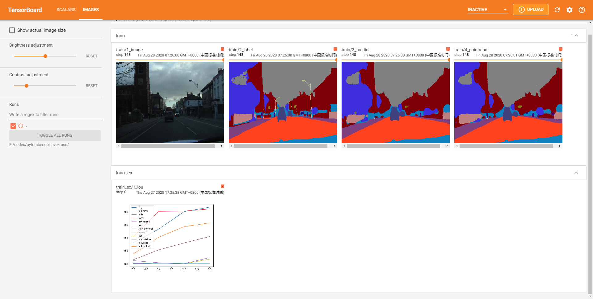

## :rocket: 编码不易，点个star！ ##

- 原始PyTorchENet代码：https://github.com/davidtvs/PyTorch-ENet
- 原始PointRend代码来自：https://github.com/facebookresearch/detectron2

#### 该项目主要学习PointRend的使用。

项目中已经加入Tensorboard功能，但在使用PointRend时无法在Tensorboard中加入网络结构图，因为模型改造过程中返回值使用了字典而不是元组，导致Tensorboard不支持。有需要的话可以自行修改成元组形式返回数据。

只测试过camvid数据集，cityscapes数据集未测试。初步测试结果是PointRend功能有起作用，但提升多少没有具体分析过。

> 使用方式
  args.py 中 USE_POINT_REDN = True 打开 PointRend 功能。

:art: 截图 

训练过程中的效果，对比最后2张图可以看到PointRend是有起到作用的。

